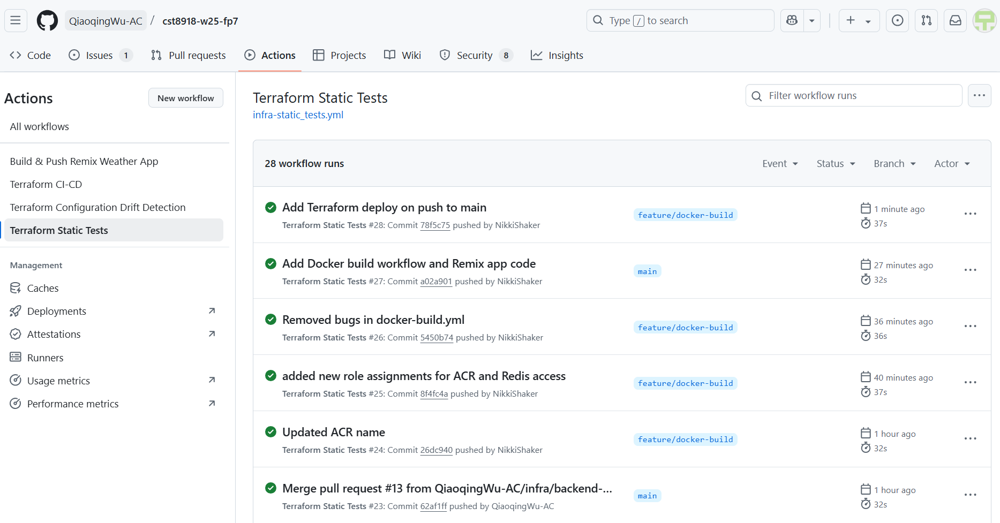
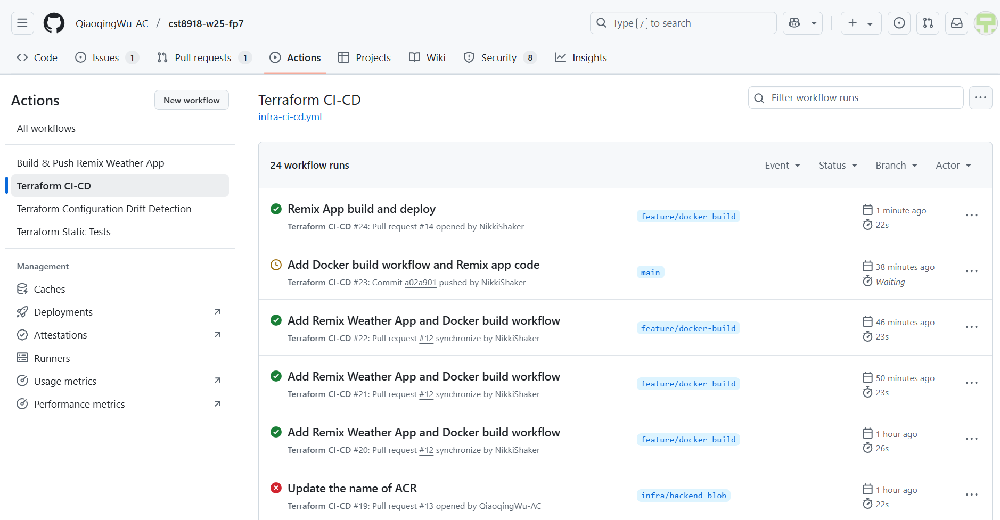
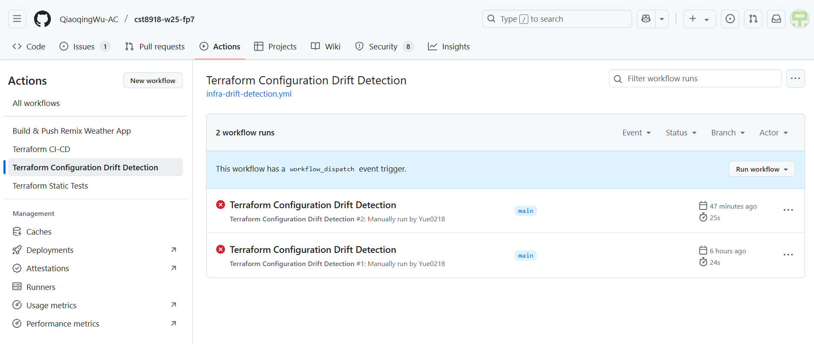
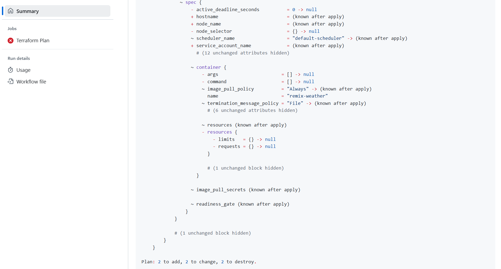
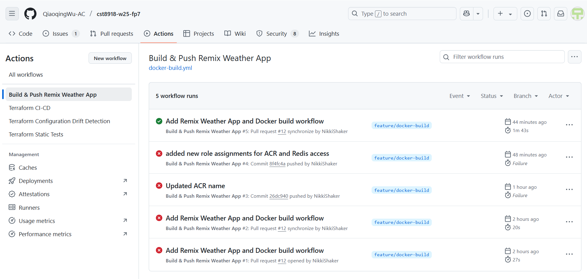
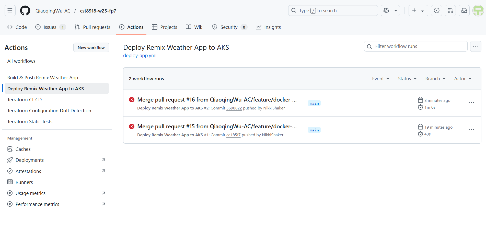

# CST8918-W25-Final Project
## Group 7 Members 

| Name               | GitHub Profiles    | College Username  |
|--------------------|--------------------|--------------------|
| Donna Ha          | [Donna-Smee](https://github.com/Donna-Smee)       | ha000070       |
| Nikki Shakeraneh  | [NikkiShaker](https://github.com/NikkiShaker)     | shak0046       |
| Qiaoqing Wu       | [QiaoqingWu-AC](https://github.com/QiaoqingWu-AC)         | wu000302       |
| Yue Gao           | [Yue0218](https://github.com/Yue0218)         | gao00094       |

## Project Overview
This project automates the deployment of a **Remix Weather Application** to Azure using **Infrastructure as Code (IaC)**
via **Terraform** and **CI/CD workflows** powered by **GitHub Actions**. It simulates a real-world environment with multiple teams and environments (dev, test, prod), applying cloud engineering best practices such as **OIDC-based authentication, remote state management**, and **modular Terraform design**.

## Screenshot of the completed GitHub Actions Workflows
### Terraform Static Tests workflow
A GitHub Actions workflow to run all Terraform static code analysis tasks (fmt, validate, tfsec) on "push" to any branch

### Terraform CI-CD
A GitHub Actions workflow to run "tflint" and "terraform plan" on "pull_request" to the main branch, run "terraform apply" on "push" to the main branch

### Terraform Configuration Drift Detection
A GitHub Actions workflow will run daily to detect drift between the deployed infrastructure and the Terraform configuration. If drift is detected, the workflow will create an issue in the repository to alert the team.


### Build & Push Remix Weather App
A GitHub Actions workflow to build and push the Docker image for the Weather App to the ACR

### Deploy Remix Weather App to the AKS cluster
A GitHub Actions workflow to deploy the Remix Weather Application to the AKS cluster



## Instructions for Running the Project
### Backend Setup
- Sets up the Azure Blob Storage backend for storing Terraform state.
- Run once locally:
```bash
cd infra/tf-backend
terraform init
terraform plan -out=tf-backend.plan
terraform apply tf-backend.plan
```
### Terraform Modules
- Manages:
  - Resource Group
  - Virtual Network + Subnets
  - AKS Clusters (`test` and `prod`)
- Uses the remote backend and GitHub OIDC for authentication.
```bash
cd infra/tf-app
terraform init -reconfigure
terraform plan -out=tf-app.plan
terraform apply tf-app.plan
```